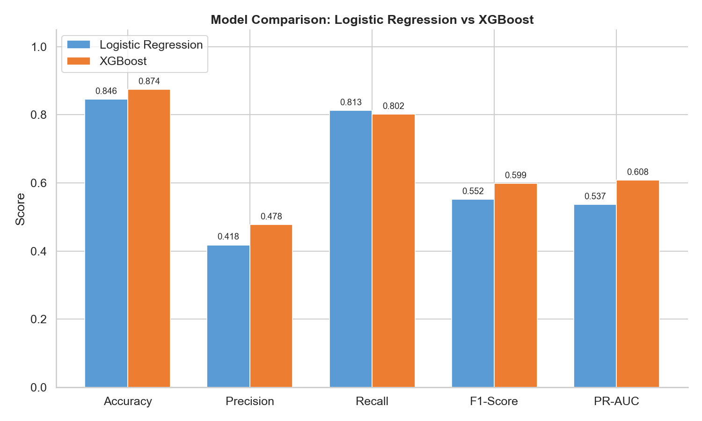
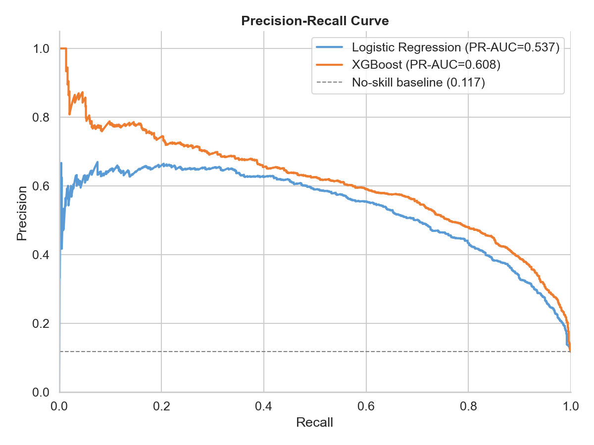
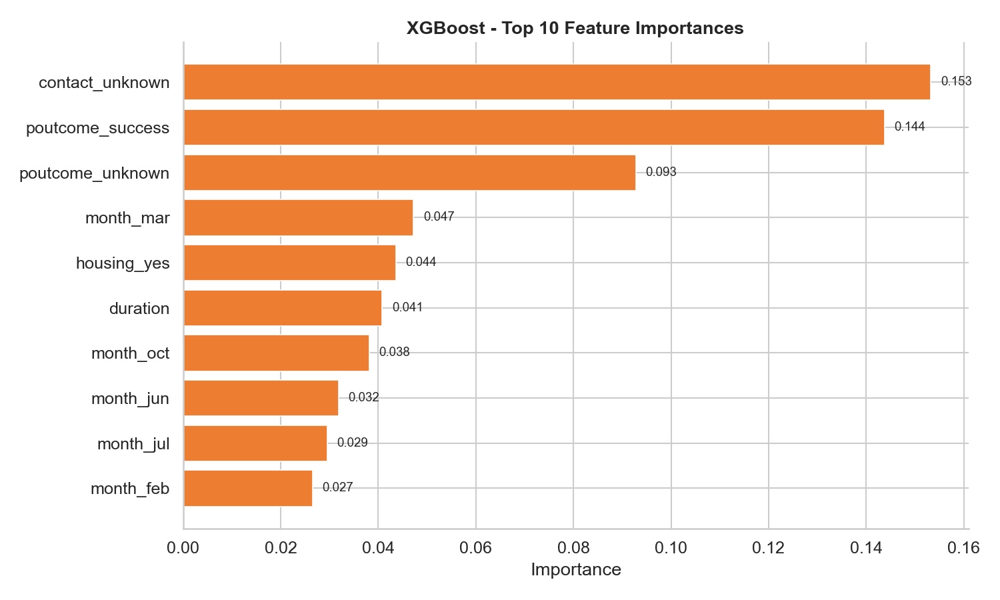
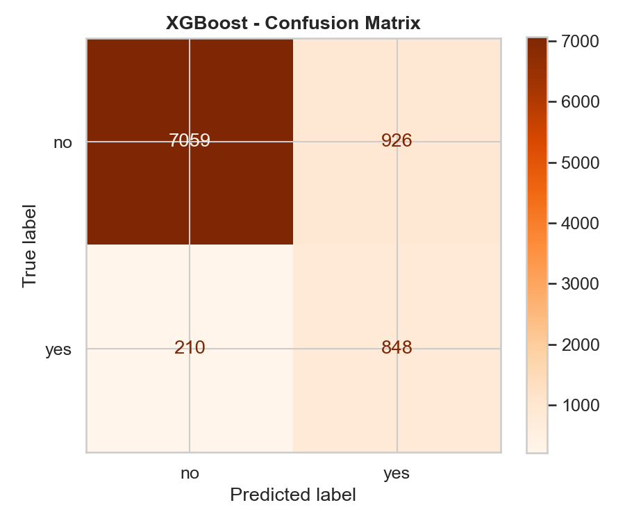

# BankMind ML — Track B: ML Engineer

A production-grade ML pipeline that predicts which bank customers are likely to subscribe to a term deposit, built for the **VITB AI Innovators Hub** community screening task.

## Dataset

[UCI Bank Marketing Dataset](https://archive.ics.uci.edu/ml/datasets/Bank+Marketing) — 45,211 customer records from a Portuguese bank's direct marketing campaigns.

- **Target**: `y` (yes/no) — whether the customer subscribed to a term deposit
- **Class split**: 88.3% no / 11.7% yes (heavily imbalanced, 7.5:1 ratio)

> **Note**: Place `bank-full.csv` in the `data/` directory before running. It is git-ignored due to size.

---

## Results

### Model Comparison

XGBoost outperforms the baseline across all key metrics:

| Metric    | Logistic Regression | XGBoost | Delta |
|-----------|--------------------:|--------:|------:|
| Accuracy  |              0.8455 |  **0.8744** | +2.9% |
| Precision |              0.4177 |  **0.4780** | +6.0% |
| Recall    |            **0.8129** |  0.8015 | -1.1% |
| F1-Score  |              0.5518 |  **0.5989** | +4.7% |
| PR-AUC    |              0.5366 |  **0.6080** | +7.1% |

> **Verdict**: XGBoost wins on 4/5 metrics. The only trade-off is a slight recall dip (81.3% vs 80.2%), but the F1 gain (+0.047) proves it delivers a better-quality lead list overall.



### Precision-Recall Curve

The PR curve is the correct evaluation tool for this 88/12 imbalanced dataset (unlike ROC-AUC, it is not inflated by the dominant negative class). XGBoost consistently dominates above the no-skill baseline.



### Feature Importance (XGBoost)

The top predictive features are `contact_unknown` (customer unreachable) and `poutcome_success` (previously converted). Note the `duration` caveat — see EXPLANATION.md.



### Confusion Matrix (XGBoost)

Out of 9,043 test customers, XGBoost correctly identified 848 of 1,058 actual subscribers (80% recall) while keeping false positives at 926.



### Sample Predictions

| # | Age | Job | Balance | Housing | Loan | Predicted | Probability | Actual |
|---|-----|-----|---------|---------|------|-----------|-------------|--------|
| 1 | 64 | retired | 109 | no | no | **yes** | 99.35% | yes |
| 2 | 42 | services | 2348 | yes | no | **yes** | 51.81% | no |
| 3 | 35 | blue-collar | 1215 | yes | no | **yes** | 65.51% | no |
| 4 | 40 | blue-collar | 640 | yes | yes | **no** | 0.16% | no |
| 5 | 44 | technician | 378 | yes | no | **no** | 0.12% | no |

---

## Repository Structure

```
bankmind-ml/
├── data/
│   └── bank-full.csv          # Raw dataset (download separately)
├── models/                    # Pre-trained model artifacts (included)
│   ├── baseline_model.pkl     # Logistic Regression pipeline
│   ├── xgb_model.pkl          # XGBoost pipeline
│   └── label_encoder.pkl      # Target label encoder
├── images/                    # Generated evaluation plots
│   ├── model_comparison.png
│   ├── precision_recall_curve.png
│   ├── feature_importance.png
│   └── confusion_matrix.png
├── src/
│   ├── __init__.py
│   ├── config.py              # Centralised paths, feature lists, constants
│   ├── data_pipeline.py       # Data loading, stratified split, preprocessing
│   ├── eda.py                 # Focused exploratory data analysis
│   ├── train_baseline.py      # Logistic Regression training
│   ├── train_tree.py          # XGBoost training
│   └── evaluate.py            # Metrics, plots, feature importance, samples
├── run_all.py                 # One-command pipeline runner
├── .gitignore
├── requirements.txt
├── README.md
└── EXPLANATION.md
```

## Setup

```bash
# 1. Clone the repository
git clone https://github.com/Devansh-Bansal-AI/bankmind-devanshbansal.git
cd bankmind-devanshbansal

# 2. Create a virtual environment (recommended)
python -m venv venv
venv\Scripts\activate        # Windows
# source venv/bin/activate   # macOS / Linux

# 3. Install dependencies
pip install -r requirements.txt

# 4. Download the dataset
#    Place bank-full.csv into the data/ directory
```

## Usage

### Quick Start (one command)

```bash
python run_all.py
```

This runs the entire pipeline: EDA → Train Baseline → Train XGBoost → Evaluate → Generate Plots.

### Step-by-Step (optional)

```bash
python -m src.eda              # Step 1 — Exploratory Data Analysis
python -m src.train_baseline   # Step 2 — Train Logistic Regression
python -m src.train_tree       # Step 3 — Train XGBoost
python -m src.evaluate         # Step 4 — Evaluate & generate plots
```

> **Note:** Pre-trained model files (`.pkl`) and evaluation plots are already included in the repo. You can review results immediately without retraining.

## Pipeline Architecture

```
bank-full.csv
     │
     ▼
 data_pipeline.py ──► Stratified train/test split (80/20)
     │                 ColumnTransformer (StandardScaler + OneHotEncoder)
     │
     ├─► train_baseline.py ──► Pipeline(preprocessor + LogisticRegression) ──► baseline_model.pkl
     │
     └─► train_tree.py    ──► Pipeline(preprocessor + XGBClassifier)       ──► xgb_model.pkl
                                                                                    │
                                                                evaluate.py ◄───────┘
                                                                    │
                                                                    ▼
                                                        Classification Reports
                                                        Metrics + PR-AUC
                                                        Feature Importances
                                                        Confusion Matrix
                                                        4 Publication Plots
                                                        5 Sample Predictions
```

## Key Design Decisions

- **Scikit-learn Pipelines**: Preprocessing and model are encapsulated in a single serialisable Pipeline, preventing train/test data leakage and simplifying inference.
- **Stratified splitting**: Maintains the 88/12 class ratio in both train and test sets.
- **Class imbalance handling**: `class_weight='balanced'` (Logistic Regression), `scale_pos_weight` (XGBoost).
- **`handle_unknown='ignore'`**: OneHotEncoder gracefully handles unseen categories at inference time.
- **Duration caveat**: The `duration` feature is a known data leakage risk (see EXPLANATION.md for full analysis).

## License

For educational/screening purposes only. Dataset is from the UCI Machine Learning Repository.
